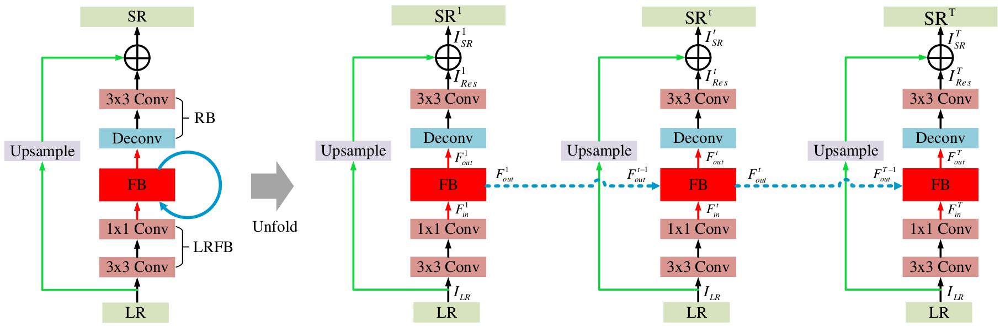
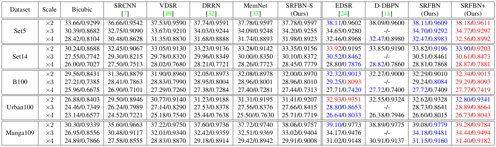
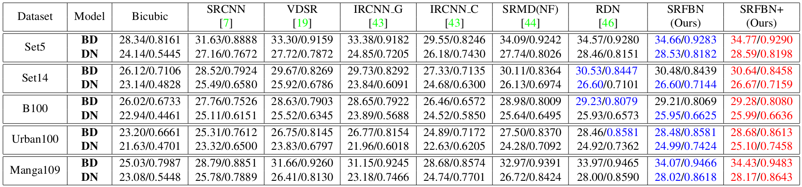
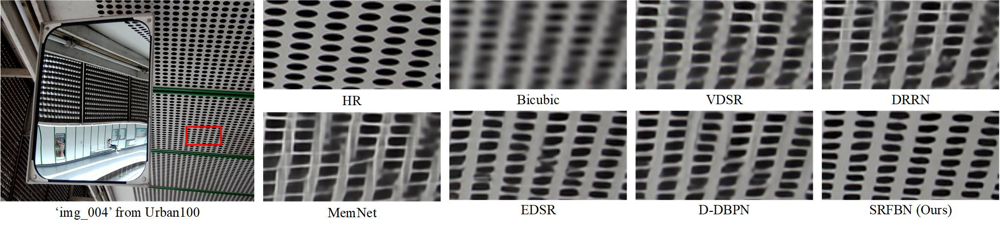
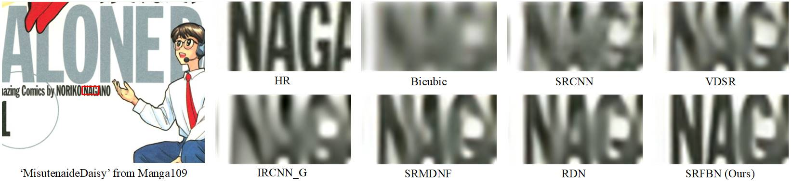
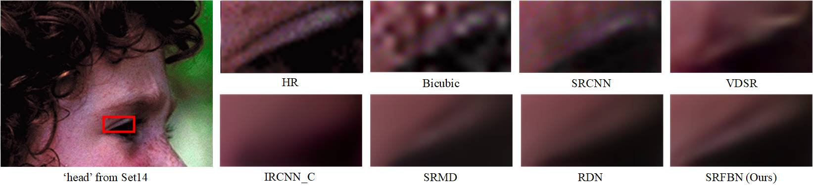

# Feedback Network for Image Super-Resolution [[arXiv]](https://arxiv.org/abs/1903.09814) [[CVF]](http://openaccess.thecvf.com/content_CVPR_2019/html/Li_Feedback_Network_for_Image_Super-Resolution_CVPR_2019_paper.html) [[Poster]](https://drive.google.com/open?id=1TcDk1RvUCIjr6KvQplaen8yq15LOBJwb)

#### Update: Our proposed Gated Multiple Feedback Network (GMFN) will appear in BMVC2019. [[Project Website]](https://github.com/liqilei/GMFN) 

##### *"With two time steps and each contains 7 RDBs, the proposed GMFN achieves better reconstruction performance compared to state-of-the-art image SR methods including RDN which contains 16 RDBs."*

This repository is Pytorch code for our proposed SRFBN.

The code is developed by [Paper99](https://github.com/Paper99) and [penguin1214](https://github.com/penguin1214) based on [BasicSR](https://github.com/xinntao/BasicSR), and tested on Ubuntu 16.04/18.04 environment (Python 3.6/3/7, PyTorch 0.4.0/1.0.0/1.0.1, CUDA 8.0/9.0/10.0) with 2080Ti/1080Ti GPUs.



The architecture of our proposed SRFBN. Blue arrows represent feedback connections. The details about our proposed SRFBN can be found in [our main paper](https://arxiv.org/abs/1903.09814).

If you find our work useful in your research or publications, please consider citing:

```latex
@inproceedings{li2019srfbn,
    author = {Li, Zhen and Yang, Jinglei and Liu, Zheng and Yang, Xiaomin and Jeon, Gwanggil and Wu, Wei},
    title = {Feedback Network for Image Super-Resolution},
    booktitle = {The IEEE Conference on Computer Vision and Pattern Recognition (CVPR)},
    year= {2019}
}

@inproceedings{wang2018esrgan,
    author = {Wang, Xintao and Yu, Ke and Wu, Shixiang and Gu, Jinjin and Liu, Yihao and Dong, Chao and Qiao, Yu and Loy, Chen Change},
    title = {ESRGAN: Enhanced super-resolution generative adversarial networks},
    booktitle = {The European Conference on Computer Vision Workshops (ECCVW)},
    year = {2018}
}
```

## Contents
1. [Requirements](#Requirements)
2. [Test](#test)
3. [Train](#train)
4. [Results](#results)
5. [Acknowledgements](#acknowledgements)

## Requirements
- Python 3 (Anaconda is recommended)
- skimage
- imageio
- Pytorch (Pytorch version >=0.4.1 is recommended)
- tqdm 
- pandas
- cv2 (pip install opencv-python)
- Matlab 

## Test

#### Quick start

1. Clone this repository:

   ```shell
   git clone https://github.com/Paper99/SRFBN_CVPR19.git
   ```

2. Download our pre-trained models from the links below, unzip the models and place them to `./models`.

   |  Model  | Param. |                      Links                                   | 
   | :-----: | :----: | :----------------------------------------------------------: |
   |  SRFBN  | 3,631K | [[GoogleDrive]](https://drive.google.com/file/d/1Dsb_-OH0CeSJVjvP9A4bh2_IBQh9R-ja/view) [[BaiduYun]](https://pan.baidu.com/s/1fIGBulcWll8MzaS87D_kPQ)(code:6qta) |
   | SRFBN-S |  483K  | [[GoogleDrive]](https://drive.google.com/file/d/1NYIS0zPrpSO5fv1xpN1hH6qX4lBYxIW5/view?usp=sharing) [[BaiduYun]](https://pan.baidu.com/s/1Du4fk0bmjTcJ4KmWJBqSYA)(code:r4cp) |

3. Then, cd to `SRFBN_CVPR19` and run **one of following commands** for evaluation on *Set5*:

   ```shell
   # SRFBN
   python test.py -opt options/test/test_SRFBN_x2_BI.json
   python test.py -opt options/test/test_SRFBN_x3_BI.json
   python test.py -opt options/test/test_SRFBN_x4_BI.json
   python test.py -opt options/test/test_SRFBN_x3_BD.json
   python test.py -opt options/test/test_SRFBN_x3_DN.json
   
   # SRFBN-S
   python test.py -opt options/test/test_SRFBN-S_x2_BI.json
   python test.py -opt options/test/test_SRFBN-S_x3_BI.json
   python test.py -opt options/test/test_SRFBN-S_x4_BI.json
   ```

4. Finally, PSNR/SSIM values for *Set5* are shown on your screen, you can find the reconstruction images in `./results`.

#### Test on standard SR benchmark

1. If you have cloned this repository and downloaded our pre-trained models, you can first download SR benchmark (Set5, Set14, B100, Urban100 and Manga109) from [GoogleDrive](https://drive.google.com/file/d/1fC0AeoCLK8Oo3utnVa3E_r_45sJla4d1/view) or [BaiduYun](https://pan.baidu.com/s/1pTw5EE-N-GclI7Yj5SnnOA)(code:z6nz).

2. Run `./results/Prepare_TestData_HR_LR.m` in Matlab to generate HR/LR images with different degradation models.

3. Edit `./options/test/test_SRFBN_example.json` for your needs according to [`./options/test/README.md`.](./options/test/README.md)

4. Then, run command:
   ```shell
   cd SRFBN_CVPR19
   python test.py -opt options/test/test_SRFBN_example.json
   ```

5. Finally, PSNR/SSIM values are shown on your screen, you can find the reconstruction images in `./results`. You can further evaluate SR results using `./results/Evaluate_PSNR_SSIM.m`.

#### Test on your own images

1. If you have cloned this repository and downloaded our pre-trained models, you can first place your own images to `./results/LR/MyImage`.

2. Edit `./options/test/test_SRFBN_example.json` for your needs according to [`./options/test/README.md`.](./options/test/README.md)

3. Then, run command:
   ```shell
   cd SRFBN_CVPR19
   python test.py -opt options/test/test_SRFBN_example.json
   ```

4. Finally, you can find the reconstruction images in `./results`.

## Train

1. Download training set DIV2K [[Official Link]](https://data.vision.ee.ethz.ch/cvl/DIV2K/) or DF2K [[GoogleDrive]](https://drive.google.com/drive/folders/1B-uaxvV9qeuQ-t7MFiN1oEdA6dKnj2vW?usp=sharing) [[BaiduYun]](https://pan.baidu.com/s/1CFIML6KfQVYGZSNFrhMXmA#list/path=%2F) (provided by [BasicSR](https://github.com/xinntao/BasicSR)).

2. Run `./scripts/Prepare_TrainData_HR_LR.m` in Matlab to generate HR/LR training pairs with corresponding degradation model and scale factor. (**Note**: Please place generated training data to **SSD (Solid-State Drive)** for fast training)

3. Run `./results/Prepare_TestData_HR_LR.m` in Matlab to generate HR/LR test images with corresponding degradation model and scale factor, and choose one of SR benchmark for evaluation during training.

4. Edit `./options/train/train_SRFBN_example.json` for your needs according to [`./options/train/README.md`.](./options/train/README.md)

5. Then, run command:
   ```shell
   cd SRFBN_CVPR19
   python train.py -opt options/train/train_SRFBN_example.json
   ```

6. You can monitor the training process in `./experiments`.

7. Finally, you can follow the **test pipeline** to evaluate your model.

## Results

#### Quantitative Results



Average PSNR/SSIM for scale factors x2, x3 and x4 with BI degradation model. The best performance is shown in red and the second best performance is shown in blue.



Average PSNR/SSIM values for scale factor x3 with BD and DN degradation models. The best performance is shown in red and the second best performance is shown in blue.

#### More Qualitative Results



Qualitative results with BI degradation model (x4) on “img 004” from Urban100.



Qualitative results with BD degradation model (x3) on “MisutenaideDaisy” from Manga109.



Qualitative results with DN degradation model (x3) on “head” from Set14.

## TODO

- Curriculum learning for complex degradation models (i.e. BD and DN degradation models).

## Acknowledgements

- Thank [penguin1214](https://github.com/penguin1214), who accompanies me to develop this repository.
- Thank [Xintao](https://github.com/xinntao). Our code structure is derived from his repository [BasicSR](https://github.com/xinntao/BasicSR). 
- Thank authors of [BasicSR](https://github.com/xinntao/BasicSR)/[RDN](https://github.com/yulunzhang/RDN)/[EDSR](https://github.com/thstkdgus35/EDSR-PyTorch). They provide many useful codes which facilitate our work.
